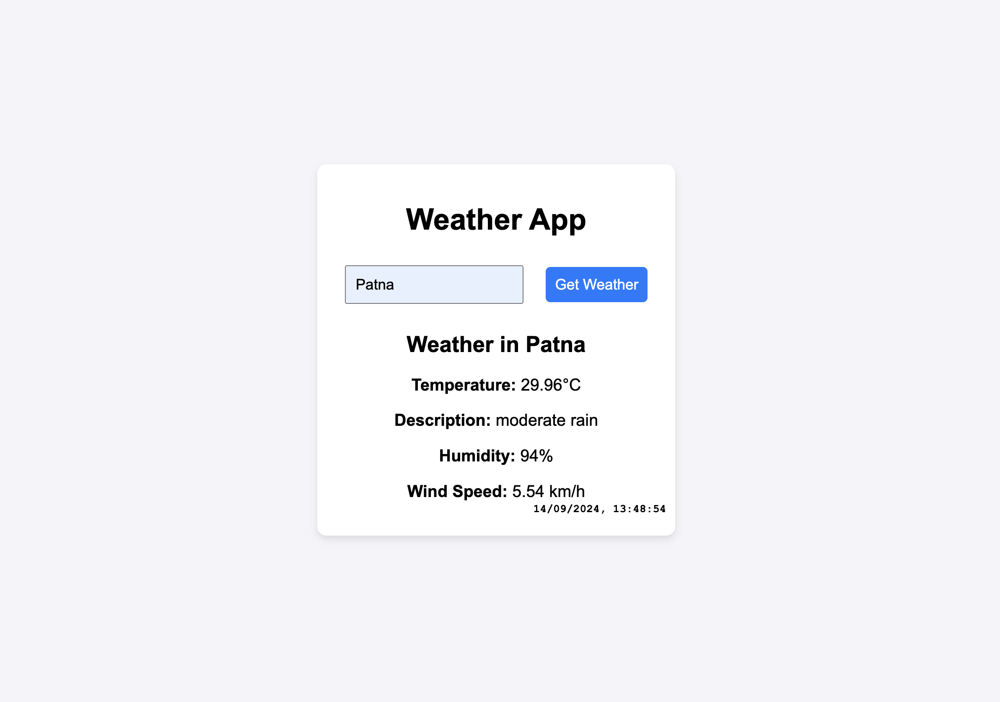

# Weather App

A basic weather application that allows users to search for the current weather of any city. The app fetches weather data using the OpenWeatherMap API and displays key information such as temperature, weather description, humidity, wind speed, and the current date and time.

## Features

- **Search for any city's weather**: Enter the city name and fetch the current weather conditions.
- **Displays weather data**: Shows temperature, weather description, humidity, and wind speed (in km/h).
- **Real-time date and time**: The current date and time is displayed in the lower right corner of the weather info box.
- **Responsive design**: The app adjusts to different screen sizes.

## Technology Stack
    

- **HTML**: Structure of the application.
- **CSS**: Styling and layout for a clean and responsive user interface.
- **JavaScript**: Functionality to fetch and display weather data using the OpenWeatherMap API.
- **OpenWeatherMap API**: Used to fetch real-time weather information.

## Screenshot


<!-- Add your screenshot image file to the root directory -->

## Getting Started

### Prerequisites

You will need an API key from OpenWeatherMap to use this application. If you don't have one, sign up on **[OpenWeatherMap](https://home.openweathermap.org/users/sign_up)** and get your API key.

### Installation

1. _Clone the repository_:
   ```bash
   git clone https://github.com/your-username/weather-app.git
   ```
